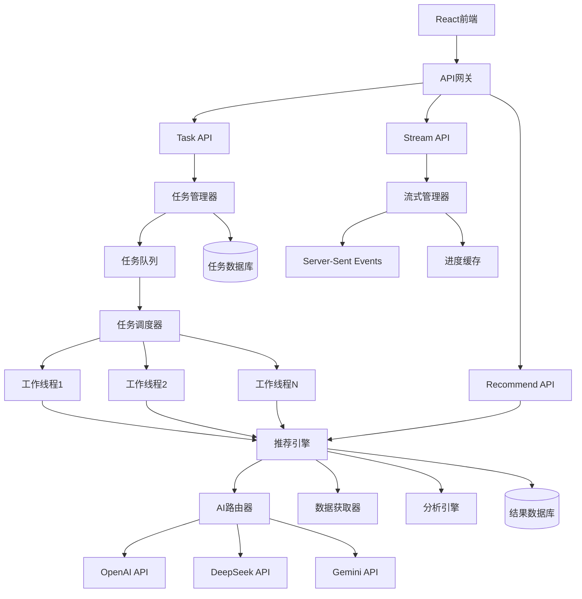
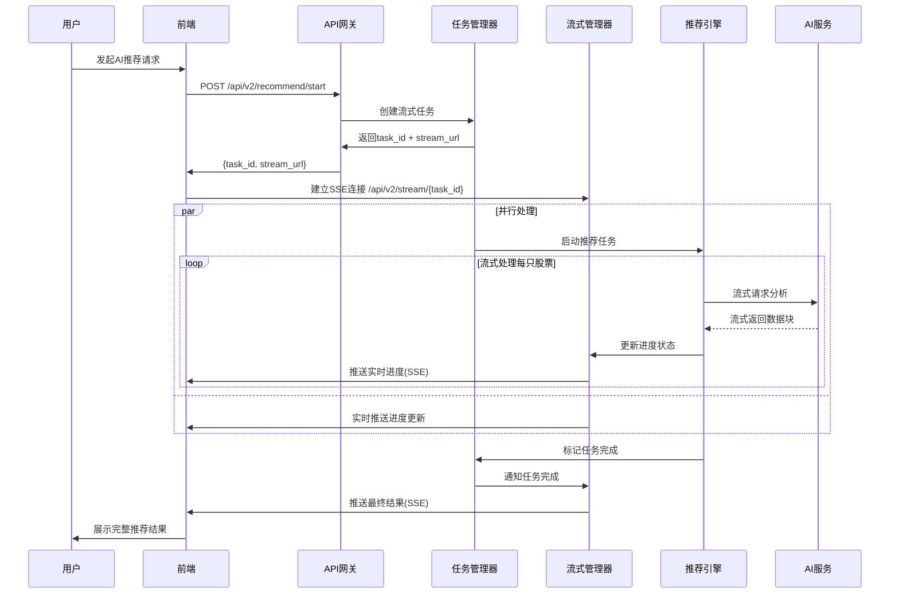

# AI推荐流式优化完全重构设计

## 概述

基于当前股票推荐系统中AI推荐和关键词推荐调用第三方API时响应缓慢的问题，设计一套**完全重构的流式推荐系统**，以现代化架构提升用户体验和系统性能。

### 目标

1. **流式优先**：所有AI推荐功能默认采用流式处理，实时展示分析过程
2. **任务持久化**：统一的任务管理系统，支持断点续传和历史追踪
3. **高性能调度**：智能任务调度器，优化资源利用和API调用效率
4. **现代化架构**：基于FastAPI异步特性和React现代状态管理
5. **功能保证**：确保AI推荐和关键词推荐功能在重构后完全可用且更强大

### 重构策略

**✅ 完全重构内容**
- 推荐系统核心架构重新设计
- 统一的任务管理和调度系统
- 流式AI处理引擎
- 现代化的前端推荐界面
- 优化的数据库设计

**🔒 必须保证的核心功能**
- AI推荐功能（手动输入股票代码推荐）
- 关键词推荐功能（根据关键词筛选推荐）
- 全市场推荐功能
- AI模型集成（OpenAI、DeepSeek、Gemini）
- 推荐结果持久化和查询

**🗑️ 可以舍弃的内容**
- 历史数据（按用户要求）
- 现有的同步推荐接口
- 现有的轮询式异步任务
- 现有的前端推荐页面布局

## 架构设计

### 系统整体架构



### 流式处理流程



## 核心组件设计

### 统一任务系统数据模型

**新的任务系统表结构（取代原有表）：**

```python
class RecommendationTask(Base):
    """统一的推荐任务表（取代原有的Recommendation表）"""
    __tablename__ = "recommendation_tasks"
    
    # 任务基本信息
    id = Column(String(32), primary_key=True)  # UUID
    task_type = Column(String(20), nullable=False)  # 'ai'|'keyword'|'market'
    status = Column(String(20), default='pending')  # 'pending'|'running'|'completed'|'failed'|'cancelled'
    priority = Column(Integer, default=5)  # 优先级 1-10
    
    # 时间戳
    created_at = Column(DateTime, default=now_bj)
    started_at = Column(DateTime, nullable=True)
    completed_at = Column(DateTime, nullable=True)
    
    # 任务参数(JSON)
    request_params = Column(Text)  # 原始请求参数
    ai_config = Column(Text)  # AI相关配置
    filter_config = Column(Text)  # 筛选配置
    weights_config = Column(Text)  # 权重配置
    
    # 执行状态
    total_symbols = Column(Integer, default=0)  # 总处理股票数
    completed_symbols = Column(Integer, default=0)  # 已完成股票数
    current_symbol = Column(String(16))  # 当前处理股票
    progress_percent = Column(Float, default=0.0)  # 进度百分比
    
    # 结果统计
    successful_count = Column(Integer, default=0)  # 成功分析数
    failed_count = Column(Integer, default=0)  # 失败分析数
    final_recommendations = Column(Integer, default=0)  # 最终推荐数
    
    # 错误处理
    error_message = Column(Text)
    retry_count = Column(Integer, default=0)
    max_retries = Column(Integer, default=3)
    
    # 性能指标
    total_tokens_used = Column(Integer, default=0)  # AI Token消耗
    total_api_calls = Column(Integer, default=0)  # API调用次数
    execution_time_seconds = Column(Float)  # 执行时间

class RecommendationResult(Base):
    """推荐结果表（替代原有的RecommendationItem）"""
    __tablename__ = "recommendation_results"
    
    id = Column(Integer, primary_key=True)
    task_id = Column(String(32), ForeignKey("recommendation_tasks.id"), index=True)
    
    # 股票信息
    symbol = Column(String(16), index=True)
    name = Column(String(64))
    
    # 分析结果
    technical_score = Column(Float)  # 技术分数
    ai_score = Column(Float)  # AI分数
    fusion_score = Column(Float)  # 融合分数
    final_score = Column(Float)  # 最终分数
    action = Column(String(16))  # 建议动作
    
    # AI分析内容
    ai_analysis = Column(Text)  # AI完整分析
    ai_confidence = Column(Float)  # AI信心度
    ai_reasoning = Column(Text)  # AI推理过程
    
    # 摘要信息
    summary = Column(Text)  # 简要描述
    key_factors = Column(Text)  # 关键因子(JSON)
    
    # 排序和筛选
    rank_in_task = Column(Integer)  # 在任务中的排名
    is_recommended = Column(Boolean, default=False)  # 是否被推荐
    
    # 时间戳
    analyzed_at = Column(DateTime, default=now_bj)

class TaskProgress(Base):
    """任务流式进度记录表"""
    __tablename__ = "task_progress"
    
    id = Column(Integer, primary_key=True)
    task_id = Column(String(32), ForeignKey("recommendation_tasks.id"), index=True)
    timestamp = Column(DateTime, default=now_bj, index=True)
    
    # 进度信息
    event_type = Column(String(20))  # 'start'|'progress'|'ai_chunk'|'symbol_complete'|'complete'|'error'
    symbol = Column(String(16))  # 当前处理的股票
    progress_data = Column(Text)  # 进度数据(JSON)
    
    # AI流式数据
    ai_chunk_content = Column(Text)  # AI流式返回的数据块
    accumulated_content = Column(Text)  # 累积的AI内容
    
    # 性能数据
    processing_time_ms = Column(Integer)  # 处理时间（毫秒）
```

### 流式推荐引擎

```python
class StreamingRecommendationEngine:
    """流式推荐引擎 - 系统核心（取代原有的EnhancedAnalyzer）"""
    
    def __init__(self):
        self.ai_router = StreamingAIRouter()
        self.data_fetcher = DataFetcher()
        self.analyzer = TechnicalAnalyzer()  # 保留技术分析部分
        self.progress_manager = ProgressManager()
        
    async def execute_recommendation_task(self, task_id: str):
        """执行推荐任务的主方法"""
        task = await self.get_task(task_id)
        if not task:
            raise ValueError(f"Task {task_id} not found")
            
        try:
            await self.update_task_status(task_id, 'running')
            
            # 根据任务类型调用不同的处理方法
            if task.task_type == 'ai':
                await self.process_ai_recommendation(task)
            elif task.task_type == 'keyword':
                await self.process_keyword_recommendation(task)
            elif task.task_type == 'market':
                await self.process_market_recommendation(task)
            else:
                raise ValueError(f"Unknown task type: {task.task_type}")
                
            await self.finalize_task(task_id)
            
        except Exception as e:
            await self.handle_task_error(task_id, str(e))
    
    async def process_ai_recommendation(self, task: RecommendationTask):
        """处理AI推荐任务（手动输入股票代码）"""
        request_params = json.loads(task.request_params)
        symbols = request_params.get('symbols', [])
        
        await self.update_task_total_symbols(task.id, len(symbols))
        
        results = []
        for i, symbol in enumerate(symbols):
            # 更新当前处理状态
            await self.progress_manager.update_current_symbol(task.id, symbol)
            
            # 获取股票数据
            stock_data = self.data_fetcher.get_stock_data(
                symbol, 
                period=request_params.get('period', '1y')
            )
            
            if stock_data is None or stock_data.empty:
                await self.progress_manager.record_symbol_failed(task.id, symbol, "数据获取失败")
                continue
            
            # 流式分析股票
            analysis_result = await self.stream_analyze_symbol(
                task.id, symbol, stock_data, 
                ai_config=json.loads(task.ai_config or '{}'),
                weights=json.loads(task.weights_config or '{}')
            )
            
            if analysis_result:
                results.append(analysis_result)
                await self.progress_manager.record_symbol_completed(task.id, symbol)
            
            # 更新进度
            progress = (i + 1) / len(symbols) * 100
            await self.progress_manager.update_progress(task.id, progress)
        
        # 排序和生成最终推荐
        final_recommendations = self.rank_and_select_recommendations(results)
        await self.save_task_results(task.id, final_recommendations)
        
        return final_recommendations
    
    async def process_keyword_recommendation(self, task: RecommendationTask):
        """处理关键词推荐任务"""
        request_params = json.loads(task.request_params)
        keyword = request_params.get('keyword')
        
        # 阶段1: 关键词筛选股票
        await self.progress_manager.update_phase(task.id, 'screening')
        
        filter_config = json.loads(task.filter_config or '{}')
        candidate_symbols = await self.screen_stocks_by_keyword(
            keyword=keyword,
            max_candidates=filter_config.get('max_candidates', 20),
            exclude_st=filter_config.get('exclude_st', True),
            min_market_cap=filter_config.get('min_market_cap'),
            board=filter_config.get('board')
        )
        
        await self.update_task_total_symbols(task.id, len(candidate_symbols))
        await self.progress_manager.update_phase(task.id, 'analyzing')
        
        # 阶段2: 流式分析筛选结果
        results = []
        for i, symbol in enumerate(candidate_symbols):
            await self.progress_manager.update_current_symbol(task.id, symbol)
            
            stock_data = self.data_fetcher.get_stock_data(
                symbol, 
                period=request_params.get('period', '1y')
            )
            
            if stock_data is not None and not stock_data.empty:
                analysis_result = await self.stream_analyze_symbol(
                    task.id, symbol, stock_data,
                    ai_config=json.loads(task.ai_config or '{}'),
                    weights=json.loads(task.weights_config or '{}'),
                    context_keyword=keyword
                )
                
                if analysis_result:
                    results.append(analysis_result)
                    await self.progress_manager.record_symbol_completed(task.id, symbol)
            
            progress = (i + 1) / len(candidate_symbols) * 100
            await self.progress_manager.update_progress(task.id, progress)
        
        # 生成最终推荐
        final_recommendations = self.rank_and_select_recommendations(
            results, 
            max_count=request_params.get('max_candidates', 5)
        )
        await self.save_task_results(task.id, final_recommendations)
        
        return final_recommendations
    
    async def stream_analyze_symbol(self, task_id: str, symbol: str, stock_data: pd.DataFrame, 
                                  ai_config: dict, weights: dict, context_keyword: str = None):
        """流式分析单个股票（核心方法）"""
        # 技术分析
        technical_analysis = self.analyzer.basic_technical_analysis(symbol, stock_data)
        
        # 构建 AI 提示词
        prompt = self.build_analysis_prompt(
            symbol, technical_analysis, stock_data, 
            weights, context_keyword
        )
        
        # 流式AI分析
        ai_chunks = []
        ai_analysis = ""
        
        await self.progress_manager.record_ai_analysis_start(task_id, symbol)
        
        async for chunk in self.ai_router.stream_complete(
            prompt=prompt,
            provider=ai_config.get('provider'),
            temperature=ai_config.get('temperature'),
            api_key=ai_config.get('api_key')
        ):
            ai_chunks.append(chunk)
            ai_analysis += chunk
            
            # 实时推送AI内容
            await self.progress_manager.push_ai_chunk(
                task_id, symbol, chunk, ai_analysis
            )
        
        # 处理AI分析结果
        ai_scores = self.extract_ai_scores(ai_analysis)
        fusion_score = self.calculate_fusion_score(
            technical_analysis.get('score', 0),
            ai_scores.get('confidence', 0),
            weights
        )
        
        result = {
            'symbol': symbol,
            'name': self.get_stock_name(symbol),
            'technical_score': technical_analysis.get('score', 0),
            'ai_score': ai_scores.get('confidence', 0),
            'fusion_score': fusion_score,
            'final_score': fusion_score,  # 可以根据需要调整
            'action': self.determine_action(fusion_score),
            'ai_analysis': ai_analysis,
            'ai_confidence': ai_scores.get('confidence'),
            'ai_reasoning': ai_scores.get('reasoning'),
            'summary': self.generate_summary(technical_analysis, ai_scores),
            'key_factors': json.dumps(self.extract_key_factors(ai_analysis))
        }
        
        await self.progress_manager.record_symbol_analysis_complete(task_id, symbol, result)
        
        return result
```

### 任务管理界面设计

```typescript
// TaskDashboard.tsx - 任务管理主界面
export default function TaskDashboard() {
  const [tasks, setTasks] = useState<RecommendationTask[]>([]);
  const [selectedTask, setSelectedTask] = useState<string | null>(null);
  const [statusFilter, setStatusFilter] = useState<string>('all');
  const [typeFilter, setTypeFilter] = useState<string>('all');
  
  const { data: tasksData, isLoading, refetch } = useQuery({
    queryKey: ['tasks', statusFilter, typeFilter],
    queryFn: () => getTaskList({ status: statusFilter, type: typeFilter }),
    refetchInterval: 5000 // 每5秒刷新
  });

  const cancelTaskMutation = useMutation({
    mutationFn: (taskId: string) => cancelTask(taskId),
    onSuccess: () => {
      message.success('任务已取消');
      refetch();
    }
  });

  const retryTaskMutation = useMutation({
    mutationFn: (taskId: string) => retryTask(taskId),
    onSuccess: () => {
      message.success('任务已重新启动');
      refetch();
    }
  });

  const columns = [
    {
      title: '任务ID',
      dataIndex: 'id',
      key: 'id',
      width: 120,
      render: (id: string) => (
        <Text copyable={{ text: id }} style={{ fontSize: '12px' }}>
          {id.slice(0, 8)}...
        </Text>
      )
    },
    {
      title: '类型',
      dataIndex: 'task_type',
      key: 'task_type',
      width: 100,
      render: (type: string) => {
        const typeConfig = {
          ai: { color: 'blue', text: 'AI推荐' },
          keyword: { color: 'green', text: '关键词' },
          market: { color: 'orange', text: '全市场' }
        };
        const config = typeConfig[type] || { color: 'default', text: type };
        return <Tag color={config.color}>{config.text}</Tag>;
      }
    },
    {
      title: '状态',
      dataIndex: 'status',
      key: 'status',
      width: 120,
      render: (status: string) => {
        const statusConfig = {
          pending: { color: 'default', text: '等待中' },
          running: { color: 'processing', text: '执行中' },
          completed: { color: 'success', text: '已完成' },
          failed: { color: 'error', text: '失败' },
          cancelled: { color: 'warning', text: '已取消' }
        };
        const config = statusConfig[status] || { color: 'default', text: status };
        return <Tag color={config.color}>{config.text}</Tag>;
      }
    },
    {
      title: '进度',
      dataIndex: 'progress_percent',
      key: 'progress',
      width: 150,
      render: (progress: number, record: any) => (
        <div>
          <Progress 
            percent={Math.round(progress || 0)} 
            size="small"
            status={record.status === 'failed' ? 'exception' : undefined}
          />
          <Text type="secondary" style={{ fontSize: '12px' }}>
            {record.completed_symbols || 0}/{record.total_symbols || 0}
          </Text>
        </div>
      )
    },
    {
      title: '当前处理',
      dataIndex: 'current_symbol',
      key: 'current_symbol',
      width: 100,
      render: (symbol: string) => symbol ? <Tag>{symbol}</Tag> : '-'
    },
    {
      title: '性能指标',
      key: 'metrics',
      width: 150,
      render: (_, record: any) => (
        <div style={{ fontSize: '12px' }}>
          <div>API调用: {record.total_api_calls || 0}</div>
          <div>Token: {record.total_tokens_used || 0}</div>
          <div>耗时: {record.execution_time_seconds ? `${record.execution_time_seconds.toFixed(1)}s` : '-'}</div>
        </div>
      )
    },
    {
      title: '创建时间',
      dataIndex: 'created_at',
      key: 'created_at',
      width: 160,
      render: (time: string) => dayjs(time).format('MM-DD HH:mm:ss')
    },
    {
      title: '操作',
      key: 'actions',
      width: 200,
      fixed: 'right',
      render: (_, record: any) => (
        <Space>
          <Button 
            size="small" 
            onClick={() => setSelectedTask(record.id)}
          >
            详情
          </Button>
          {record.status === 'running' && (
            <Popconfirm
              title="确定要取消这个任务吗？"
              onConfirm={() => cancelTaskMutation.mutate(record.id)}
            >
              <Button size="small" danger>取消</Button>
            </Popconfirm>
          )}
          {record.status === 'failed' && (
            <Button 
              size="small" 
              onClick={() => retryTaskMutation.mutate(record.id)}
            >
              重试
            </Button>
          )}
          {record.status === 'completed' && (
            <Button 
              size="small" 
              type="primary"
              onClick={() => viewTaskResults(record.id)}
            >
              查看结果
            </Button>
          )}
        </Space>
      )
    }
  ];

  return (
    <div className="task-dashboard">
      <Card title="任务管理中心" extra={
        <Space>
          <Select
            placeholder="状态筛选"
            style={{ width: 120 }}
            value={statusFilter}
            onChange={setStatusFilter}
            options={[
              { value: 'all', label: '全部状态' },
              { value: 'pending', label: '等待中' },
              { value: 'running', label: '执行中' },
              { value: 'completed', label: '已完成' },
              { value: 'failed', label: '失败' },
              { value: 'cancelled', label: '已取消' }
            ]}
          />
          <Select
            placeholder="类型筛选"
            style={{ width: 120 }}
            value={typeFilter}
            onChange={setTypeFilter}
            options={[
              { value: 'all', label: '全部类型' },
              { value: 'ai', label: 'AI推荐' },
              { value: 'keyword', label: '关键词' },
              { value: 'market', label: '全市场' }
            ]}
          />
          <Button onClick={() => refetch()} icon={<ReloadOutlined />}>
            刷新
          </Button>
        </Space>
      }>
        <Table
          columns={columns}
          dataSource={tasksData?.tasks || []}
          loading={isLoading}
          rowKey="id"
          pagination={{
            total: tasksData?.total || 0,
            pageSize: 20,
            showSizeChanger: true,
            showQuickJumper: true,
            showTotal: (total) => `共 ${total} 个任务`
          }}
          scroll={{ x: 1200 }}
          size="small"
        />
      </Card>
      
      {/* 任务详情抽屉 */}
      <TaskDetailDrawer
        taskId={selectedTask}
        open={!!selectedTask}
        onClose={() => setSelectedTask(null)}
      />
    </div>
  );
}

// TaskDetailDrawer.tsx - 任务详情抽屉
interface TaskDetailDrawerProps {
  taskId: string | null;
  open: boolean;
  onClose: () => void;
}

const TaskDetailDrawer: React.FC<TaskDetailDrawerProps> = ({
  taskId,
  open,
  onClose
}) => {
  const { data: taskDetail, isLoading } = useQuery({
    queryKey: ['task-detail', taskId],
    queryFn: () => taskId ? getTaskDetail(taskId) : null,
    enabled: !!taskId,
    refetchInterval: taskDetail?.status === 'running' ? 2000 : false
  });

  const { data: progressData } = useQuery({
    queryKey: ['task-progress', taskId],
    queryFn: () => taskId ? getTaskProgress(taskId) : null,
    enabled: !!taskId && taskDetail?.status === 'running',
    refetchInterval: 1000 // 实时更新进度
  });

  return (
    <Drawer
      title={`任务详情 - ${taskId?.slice(0, 8)}...`}
      placement="right"
      onClose={onClose}
      open={open}
      width={800}
    >
      {isLoading ? (
        <Skeleton active />
      ) : taskDetail ? (
        <div className="task-detail">
          {/* 基本信息 */}
          <Card title="基本信息" size="small" style={{ marginBottom: 16 }}>
            <Descriptions size="small" column={2}>
              <Descriptions.Item label="任务ID">{taskDetail.id}</Descriptions.Item>
              <Descriptions.Item label="类型">{taskDetail.task_type}</Descriptions.Item>
              <Descriptions.Item label="状态">
                <Tag color={getStatusColor(taskDetail.status)}>{taskDetail.status}</Tag>
              </Descriptions.Item>
              <Descriptions.Item label="优先级">{taskDetail.priority}</Descriptions.Item>
              <Descriptions.Item label="创建时间">
                {dayjs(taskDetail.created_at).format('YYYY-MM-DD HH:mm:ss')}
              </Descriptions.Item>
              <Descriptions.Item label="开始时间">
                {taskDetail.started_at ? dayjs(taskDetail.started_at).format('YYYY-MM-DD HH:mm:ss') : '-'}
              </Descriptions.Item>
              <Descriptions.Item label="完成时间">
                {taskDetail.completed_at ? dayjs(taskDetail.completed_at).format('YYYY-MM-DD HH:mm:ss') : '-'}
              </Descriptions.Item>
              <Descriptions.Item label="执行时长">
                {taskDetail.execution_time_seconds ? `${taskDetail.execution_time_seconds.toFixed(1)}s` : '-'}
              </Descriptions.Item>
            </Descriptions>
          </Card>

          {/* 执行状态 */}
          <Card title="执行状态" size="small" style={{ marginBottom: 16 }}>
            <Row gutter={16}>
              <Col span={8}>
                <Statistic title="总股票数" value={taskDetail.total_symbols || 0} />
              </Col>
              <Col span={8}>
                <Statistic 
                  title="已完成" 
                  value={taskDetail.completed_symbols || 0}
                  valueStyle={{ color: '#3f8600' }}
                />
              </Col>
              <Col span={8}>
                <Statistic 
                  title="成功率" 
                  value={(taskDetail.successful_count / Math.max(taskDetail.completed_symbols, 1) * 100).toFixed(1)}
                  suffix="%"
                  valueStyle={{ color: taskDetail.failed_count > 0 ? '#cf1322' : '#3f8600' }}
                />
              </Col>
            </Row>
            
            <div style={{ marginTop: 16 }}>
              <Progress 
                percent={Math.round(taskDetail.progress_percent || 0)}
                status={taskDetail.status === 'failed' ? 'exception' : undefined}
              />
              {taskDetail.current_symbol && (
                <div style={{ marginTop: 8 }}>
                  <Text type="secondary">当前处理: </Text>
                  <Tag>{taskDetail.current_symbol}</Tag>
                </div>
              )}
            </div>
          </Card>

          {/* 性能指标 */}
          <Card title="性能指标" size="small" style={{ marginBottom: 16 }}>
            <Row gutter={16}>
              <Col span={8}>
                <Statistic title="API调用次数" value={taskDetail.total_api_calls || 0} />
              </Col>
              <Col span={8}>
                <Statistic title="Token消耗" value={taskDetail.total_tokens_used || 0} />
              </Col>
              <Col span={8}>
                <Statistic title="重试次数" value={taskDetail.retry_count || 0} />
              </Col>
            </Row>
          </Card>

          {/* 实时进度流 */}
          {taskDetail.status === 'running' && progressData && (
            <Card title="实时进度" size="small" style={{ marginBottom: 16 }}>
              <div style={{ maxHeight: 300, overflow: 'auto' }}>
                {progressData.map((progress: any, index: number) => (
                  <div key={index} style={{ 
                    padding: '8px 12px', 
                    borderLeft: '3px solid #1890ff',
                    marginBottom: 8,
                    backgroundColor: '#f6f6f6'
                  }}>
                    <div style={{ display: 'flex', justifyContent: 'space-between' }}>
                      <Text strong>{progress.symbol}</Text>
                      <Text type="secondary" style={{ fontSize: '12px' }}>
                        {dayjs(progress.timestamp).format('HH:mm:ss')}
                      </Text>
                    </div>
                    <div style={{ marginTop: 4 }}>
                      <Tag size="small">{progress.event_type}</Tag>
                      {progress.ai_chunk_content && (
                        <Text style={{ fontSize: '12px', marginLeft: 8 }}>
                          {progress.ai_chunk_content.slice(0, 100)}...
                        </Text>
                      )}
                    </div>
                  </div>
                ))}
              </div>
            </Card>
          )}

          {/* 错误信息 */}
          {taskDetail.error_message && (
            <Card title="错误信息" size="small">
              <Alert
                type="error"
                message={taskDetail.error_message}
                showIcon
              />
            </Card>
          )}
        </div>
      ) : (
        <Empty description="任务详情加载失败" />
      )}
    </Drawer>
  );
};
```

## API接口规范

### 任务管理接口

| 接口 | 方法 | 说明 |
|------|------|------|
| `/api/v2/tasks` | GET | 获取任务列表 |
| `/api/v2/tasks/{task_id}` | GET | 获取任务详情 |
| `/api/v2/tasks/{task_id}/progress` | GET | 获取任务实时进度 |
| `/api/v2/tasks/{task_id}/cancel` | POST | 取消任务 |
| `/api/v2/tasks/{task_id}/retry` | POST | 重试失败任务 |
| `/api/v2/tasks/{task_id}/results` | GET | 获取任务结果 |

**任务列表响应格式：**
```json
{
  "total": 156,
  "page": 1,
  "page_size": 20,
  "tasks": [
    {
      "id": "abc123def456",
      "task_type": "ai",
      "status": "running",
      "priority": 5,
      "created_at": "2024-01-15T10:30:00",
      "started_at": "2024-01-15T10:30:05",
      "progress_percent": 65.5,
      "total_symbols": 10,
      "completed_symbols": 6,
      "current_symbol": "000001",
      "successful_count": 5,
      "failed_count": 1,
      "total_api_calls": 12,
      "total_tokens_used": 8540,
      "execution_time_seconds": 45.2
    }
  ]
}
```
```

